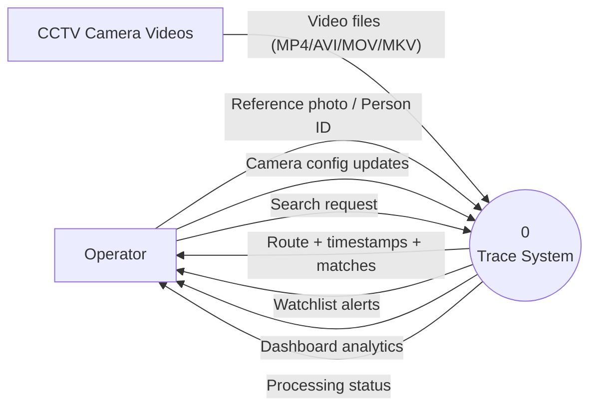
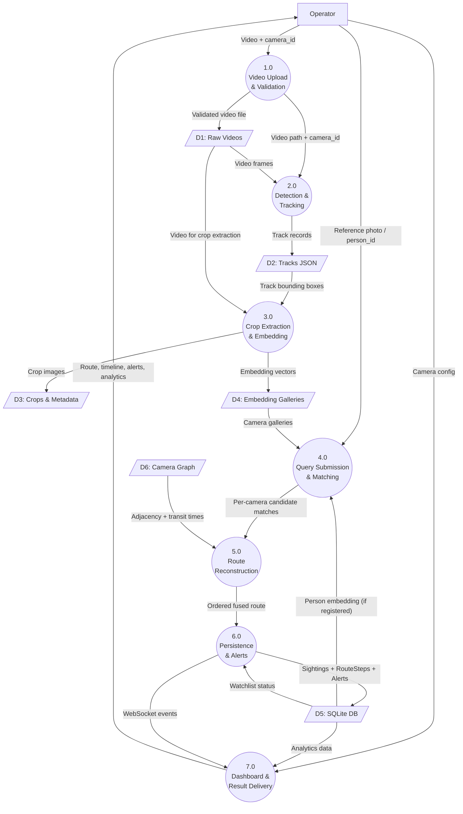
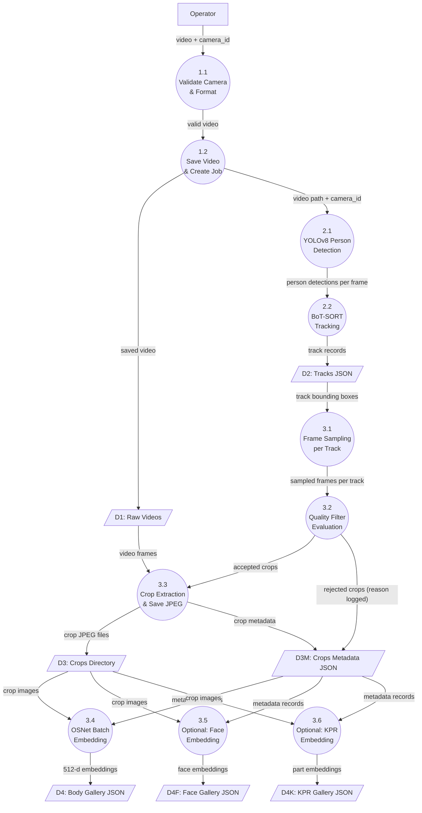
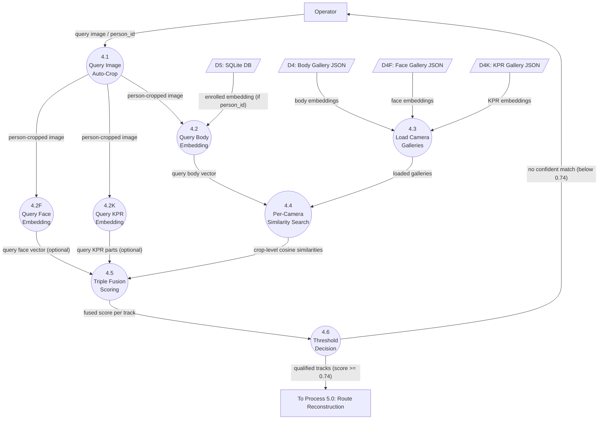
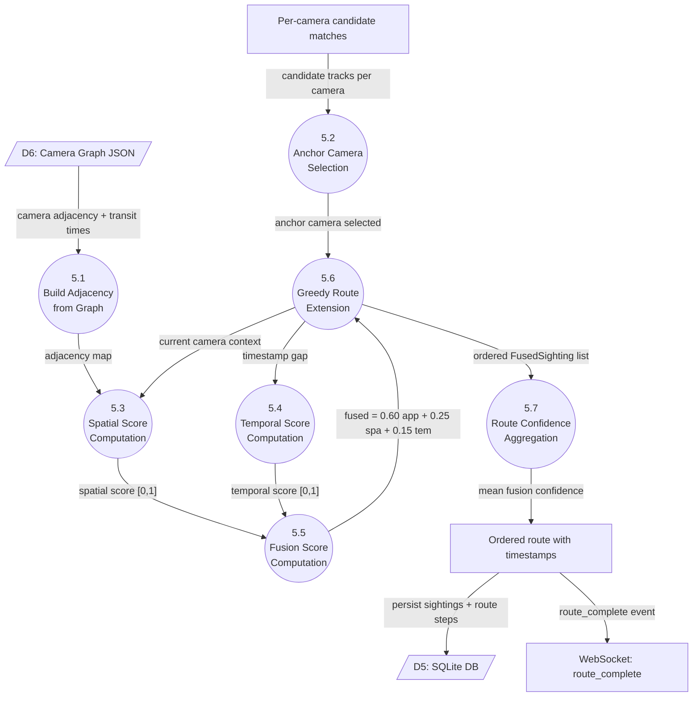
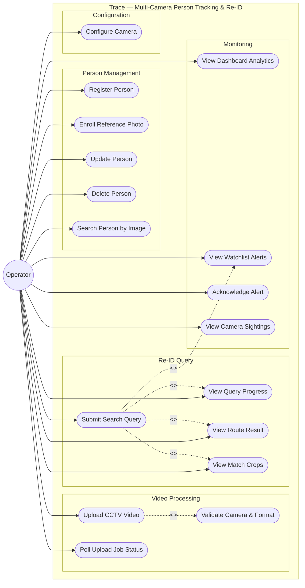
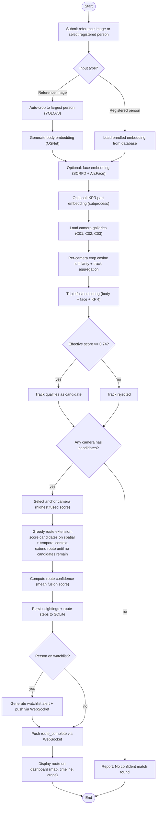
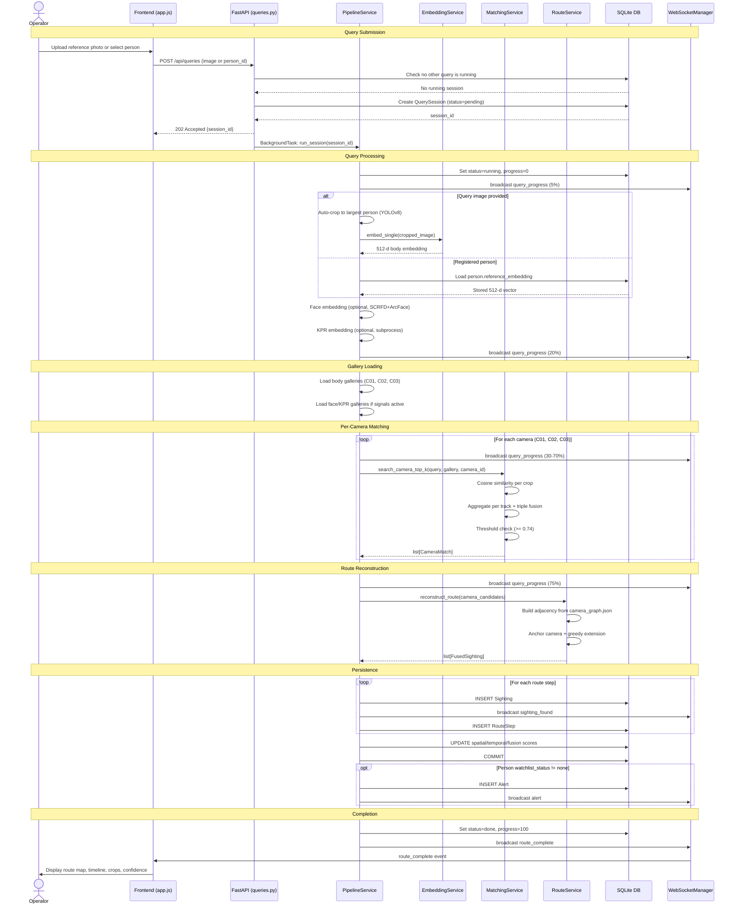
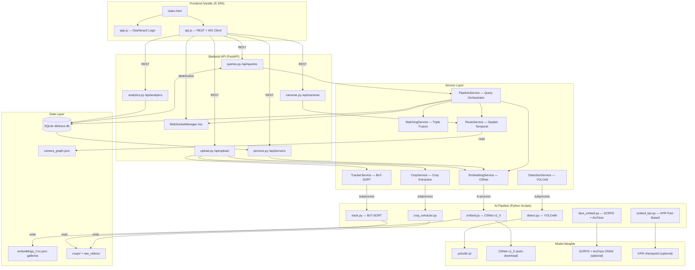
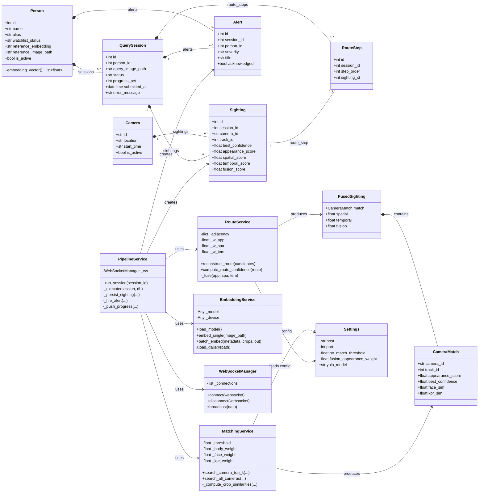

# Trace — Software Requirements Specification & Design

## AI-Powered Multi-Camera Person Tracking & Re-Identification

**Software Engineering Laboratory — Assignment 2**

| Field | Value |
|---|---|
| Project Title | Trace |
| Subtitle | AI-Powered Multi-Camera Person Tracking & Re-Identification |
| Course | Software Engineering Laboratory |
| Assignment | Assignment 2 |
| Student Name | Anmol Goyal |
| Roll Number | 24103044 |
| Date | 2 October 2026 |
| Version | 1.0 |

---

## Table of Contents

1. Introduction
2. Overall Description
3. Functional Requirements
4. Non-Functional Requirements
5. External Interface Requirements
6. Data Requirements
7. System Constraints
8. Assumptions
9. Future Scope
10. System Design Diagrams
11. Traceability Matrix

---

## 1. Introduction

### 1.1 Purpose

This Software Requirements Specification (SRS) documents the functional and non-functional requirements of **Trace**, an AI-powered multi-camera person tracking and re-identification system. It is intended as a complete reference for the system's current implemented behaviour and serves as the basis for the SE Lab Assignment 2 submission.

### 1.2 Scope

Trace accepts CCTV video uploads from up to three active cameras (C01, C02, C03), processes them through a multi-stage AI pipeline (detection → tracking → crop extraction → embedding generation), and enables an operator to search for a specific person across all cameras using either a reference photograph or a previously registered person record. The system reconstructs the person's cross-camera route with timestamps, displays results on a real-time dashboard, and generates alerts when watchlisted persons are detected.

The system is a single-operator, single-server application with no authentication. It processes pre-recorded video files in batch mode — it does not perform live video stream processing.

### 1.3 Intended Audience

- Software engineering course evaluators
- Developers maintaining or extending the system
- Students studying the system architecture

### 1.4 Product Overview

Trace consists of three layers:

1. **Frontend** — A single-page vanilla JavaScript dashboard served by the backend, providing video upload, person registration, Re-ID search, route visualisation, and analytics views.
2. **Backend API** — A FastAPI application exposing REST endpoints and a WebSocket channel for real-time progress events.
3. **AI Pipeline** — A set of Python scripts and service wrappers performing person detection (YOLOv8n), multi-object tracking (BoT-SORT), quality-filtered crop extraction, and appearance embedding generation using OSNet x1_0 with optional face (SCRFD + ArcFace) and KPR part-based models.

---

## 2. Overall Description

### 2.1 Product Perspective

Trace is a self-contained desktop/server application. It runs as a single Uvicorn process serving both the API and the static frontend. Data is persisted to a local SQLite database (`db/trace.db`) and JSON files on disk (`dataset/`). There is no dependency on external services at runtime beyond optional model weight downloads on first startup.

### 2.2 Product Functions (Summary)

| Function | Status |
|---|---|
| Upload CCTV video per camera | Implemented |
| Validate camera ID and video format | Implemented |
| Person detection (YOLOv8n) | Implemented |
| Multi-object tracking (BoT-SORT) | Implemented |
| Quality-filtered crop extraction | Implemented |
| OSNet body embedding generation | Implemented |
| Face embedding (SCRFD + ArcFace, optional) | Implemented (optional, requires weights) |
| KPR part-based embedding (optional) | Implemented (optional, requires weights) |
| Register person with watchlist status | Implemented |
| Enroll reference photo embedding | Implemented |
| Submit search query (photo or registered person) | Implemented |
| Query image auto-crop to largest person | Implemented |
| Cross-camera matching with triple fusion | Implemented |
| No-confident-match threshold | Implemented |
| Spatial-temporal route reconstruction | Implemented |
| Persist sightings and route steps | Implemented |
| Watchlist alert generation | Implemented |
| WebSocket real-time progress events | Implemented |
| Dashboard analytics | Implemented |
| Camera configuration (location, start time, transit) | Implemented |
| Authentication / multi-user | Not implemented |
| Live video stream processing | Not implemented |
| Cameras C04, C05 | Not implemented (disabled in config) |

### 2.3 User Classes

| User Class | Description |
|---|---|
| Operator | The sole user. Uploads video, registers persons, submits search queries, views results and alerts. No authentication is required. |

There is no separate administrator role. All operations are available to any user who can reach the server.

### 2.4 Operating Environment

| Component | Requirement |
|---|---|
| OS | Windows 10/11, macOS, Linux |
| Python | 3.9+ (3.11 recommended) |
| RAM | 4 GB minimum, 8 GB recommended for KPR |
| GPU | Optional (NVIDIA CUDA); CPU-only is supported |
| Database | SQLite via aiosqlite |
| Server | Uvicorn (ASGI) |
| Browser | Any modern browser (Chrome, Firefox, Edge, Safari) |

### 2.5 Design Constraints

- Single-process server (Uvicorn with reload in development).
- SQLite database — single-writer limitation.
- Upload job state is stored in-memory (lost on server restart).
- Only MVP cameras C01, C02, C03 are active. C04 and C05 are defined in configuration but disabled.
- KPR embedding requires a separate subprocess due to package name conflict with the standard torchreid library.
- Video formats limited to `.mp4`, `.avi`, `.mov`, `.mkv`.
- Image formats limited to `.jpg`, `.jpeg`, `.png`, `.webp`.

### 2.6 Assumptions and Dependencies

- Camera videos are pre-recorded files, not live streams.
- Each camera has a configured wall-clock start time so frame timestamps map to real-world time.
- The camera physical topology (adjacency graph and transit times) is known and configured in `camera_graph.json`.
- OSNet pretrained weights are downloaded automatically on first run (requires internet once).
- Optional models (face, KPR) require manual weight downloads.

---

## 3. Functional Requirements

### FR-01: Video Upload

The system shall allow the operator to upload a video file (MP4, AVI, MOV, or MKV) associated with a specific camera (C01, C02, or C03).

**Implementation:** `backend/app/routers/upload.py` — `POST /api/upload/video`

### FR-02: Video/Camera Input Validation

The system shall reject uploads with an invalid camera ID (not in {C01, C02, C03}) or an unsupported video file extension, returning an appropriate error message.

**Implementation:** `backend/app/routers/upload.py` — validation checks before file save.

### FR-03: Person Detection

The system shall detect all persons in each video frame using YOLOv8n with a configurable confidence threshold (default 0.6, COCO class 0 only).

**Implementation:** `ai_pipeline/detection/detect.py`, invoked via `backend/app/services/detection_service.py`.

### FR-04: Multi-Object Tracking

The system shall assign persistent track IDs to detected persons within a camera video using the BoT-SORT tracker (via Ultralytics), producing per-frame track records with bounding boxes and timestamps.

**Implementation:** `ai_pipeline/tracking/track.py`, invoked via `backend/app/services/tracker_service.py`.

### FR-05: Quality-Filtered Crop Extraction

The system shall extract person crop images from tracked bounding boxes, applying quality filters (minimum width 40 px, minimum height 100 px, severe edge truncation rejection), and produce a metadata JSON file listing all accepted crops with camera, track, frame, timestamp, and bounding box information.

**Implementation:** `ai_pipeline/reid/crop_extractor.py` with `quality_filter.py` and `sampling.py`, invoked via `backend/app/services/crop_service.py`.

### FR-06: Body Embedding Generation (OSNet)

The system shall generate a 512-dimensional appearance embedding for each quality-filtered crop using OSNet x1_0 and store the gallery as a JSON file (`embeddings_<camera_id>.json`).

**Implementation:** `ai_pipeline/reid/embed.py`, invoked via `backend/app/services/embedding_service.py` (batch mode).

### FR-07: Optional Face Embedding Generation

When SCRFD and ArcFace ONNX weights are configured, the system shall detect faces in crops and generate 512-dimensional face embeddings stored as `face_embeddings_<camera_id>.json`. If weights are absent, this step is skipped gracefully.

**Implementation:** `ai_pipeline/reid/face_embed.py`, invoked from `backend/app/routers/upload.py`.

### FR-08: Optional KPR Part-Based Embedding Generation

When KPR weights and configuration are available, the system shall generate part-based embeddings (holistic + 8 body parts × 512-d) stored as `kpr_embeddings_<camera_id>.json`. Runs in a fresh subprocess due to package conflict. Skipped gracefully if unavailable.

**Implementation:** `ai_pipeline/reid/embed_kpr.py`, invoked from `backend/app/routers/upload.py` via subprocess.

### FR-09: Person Registration

The system shall allow the operator to register a person with a name, optional alias, optional description, and a watchlist status (none, missing, suspect, or poi).

**Implementation:** `backend/app/routers/persons.py` — `POST /api/persons`.

### FR-10: Reference Photo Enrollment

The system shall allow the operator to upload a reference photo for a registered person and generate an OSNet embedding stored with the person record. Re-enrollment replaces the previous embedding.

**Implementation:** `backend/app/routers/persons.py` — `POST /api/persons/{id}/enroll`.

### FR-11: Search Query Submission

The system shall allow the operator to submit a person search query using either a registered person ID (uses stored embedding) or an uploaded reference image (embedded on the fly). Only one query may run at a time; concurrent submissions are rejected with HTTP 409.

**Implementation:** `backend/app/routers/queries.py` — `POST /api/queries`.

### FR-12: Query Image Auto-Crop

When a multi-person image is submitted as a query, the system shall automatically detect persons using YOLOv8 and crop to the largest detected person before embedding. If no person is detected, the original image is used.

**Implementation:** `backend/app/services/pipeline_service.py` — `_autocrop_query_person()`.

### FR-13: Cross-Camera Matching

The system shall compare the query embedding against all available camera galleries using cosine similarity, aggregate results per track (max similarity, mean top-3), and return up to 3 candidate tracks per camera that exceed the no-match threshold.

**Implementation:** `backend/app/services/matching_service.py` — `search_camera_top_k()`.

### FR-14: Triple Fusion Matching

When face and/or KPR galleries are available, the system shall fuse body, face, and KPR similarity signals per track using configurable weights (default: body 0.40, face 0.30, KPR 0.60), re-normalised by active signal count.

**Implementation:** `backend/app/services/matching_service.py` — `_effective_score()`.

### FR-15: No-Confident-Match Threshold

The system shall reject tracks whose effective (fused) score falls below the no-match threshold (default 0.74). If no track in any camera exceeds the threshold, the route is empty and the system reports no confident match.

**Implementation:** `backend/app/services/matching_service.py` — threshold check in `search_camera_top_k()`.

### FR-16: Route Reconstruction

The system shall reconstruct an ordered cross-camera route from per-camera candidate matches using a greedy algorithm that fuses appearance score with spatial plausibility (camera adjacency graph) and temporal plausibility (Gaussian transit-time model). Fusion weights: appearance 0.60, spatial 0.25, temporal 0.15.

**Implementation:** `backend/app/services/route_service.py` — `reconstruct_route()`.

### FR-17: Sighting and Route Persistence

The system shall persist one Sighting record per matched camera and ordered RouteStep records for the reconstructed route in the SQLite database.

**Implementation:** `backend/app/services/pipeline_service.py` — `_persist_sighting()`, RouteStep creation.

### FR-18: Watchlist Alert Generation

When a query matches a person whose watchlist status is not "none", the system shall generate an Alert record with severity HIGH (for missing/suspect) or MEDIUM (for poi) and push it via WebSocket.

**Implementation:** `backend/app/services/pipeline_service.py` — `_fire_alert()`.

### FR-19: Real-Time WebSocket Progress

The system shall push progress events (query_progress, sighting_found, route_complete, alert, error) to all connected WebSocket clients throughout query execution.

**Implementation:** `backend/app/core/websocket_manager.py`, `backend/app/services/pipeline_service.py`.

### FR-20: Route Result Retrieval

The system shall provide an endpoint to retrieve the completed route for a query session, including ordered steps with camera location, timestamp, confidence, fusion score, and crop image path.

**Implementation:** `backend/app/routers/queries.py` — `GET /api/queries/{id}/route`.

### FR-21: Dashboard Analytics

The system shall provide aggregated statistics: total persons, watchlist count, total/completed queries, total sightings, total/unacknowledged alerts, active cameras, recent alerts, and per-camera activity.

**Implementation:** `backend/app/routers/analytics.py` — `GET /api/analytics/dashboard`.

### FR-22: Camera Configuration

The system shall allow the operator to update a camera's location name, recording start time, and transit times to neighbouring cameras. Changes are persisted to both the database and `camera_graph.json`.

**Implementation:** `backend/app/routers/cameras.py` — `PATCH /api/cameras/{id}`.

### FR-23: Alert Acknowledgement

The system shall allow the operator to mark an alert as acknowledged.

**Implementation:** `backend/app/routers/analytics.py` — `POST /api/analytics/alerts/{id}/acknowledge`.

### FR-24: Upload Job Status Polling

The system shall provide endpoints to poll the status of a video upload job and list all jobs.

**Implementation:** `backend/app/routers/upload.py` — `GET /api/upload/status/{job_id}`, `GET /api/upload/jobs`.

---

## 4. Non-Functional Requirements

### NFR-01: Performance

Video processing time depends on hardware. On CPU, a 35-second video takes approximately 6–11 minutes (body only). GPU reduces this to 1–2 minutes. The system runs pipeline stages in background tasks or subprocesses to avoid blocking the API event loop.

### NFR-02: Reliability

Optional pipeline stages (face, KPR) catch exceptions and degrade gracefully — a failing optional signal never crashes the pipeline or blocks the upload job. The body (OSNet) gallery is always produced.

### NFR-03: Usability

The frontend is a single-page dashboard with sidebar navigation covering: Dashboard, Re-ID Search Query, Route Map, Watchlist & Persons, Pipeline Video Studio, and Camera Configuration. Real-time WebSocket updates eliminate the need for manual polling.

### NFR-04: Maintainability

The backend follows a layered architecture: routers (HTTP handlers) → services (business logic) → ai_pipeline scripts (ML inference). Each service wraps a single pipeline script via subprocess, keeping ML code isolated from web framework code.

### NFR-05: Extensibility

The matching service is dimension-agnostic (works with any embedding dimension). New Re-ID backbones can be added by producing a gallery JSON file in the expected format. The camera graph is data-driven — adding cameras requires only configuration changes.

### NFR-06: Security

The system currently implements no authentication or authorization. CORS is configured to allow all origins (development mode). This is documented as a constraint, not a feature.

### NFR-07: Availability

The system is designed for single-operator use. One query runs at a time by design (enforced with HTTP 409). Upload jobs run sequentially in background tasks.

---

## 5. External Interface Requirements

### 5.1 User Interface

A single-page web application served at `http://localhost:8000`. Views include:

- **Dashboard** — Analytics stats, recent alerts, camera activity
- **Re-ID Search Query** — Submit search by photo or registered person
- **Route Map** — SVG floor-plan with animated route visualisation
- **Watchlist & Persons** — Register/manage persons, enroll photos
- **Pipeline Video Studio** — Upload video per camera, view job progress
- **Camera Configuration** — Edit camera location, start time, transit times

### 5.2 REST API

Base URL: `/api`. Full OpenAPI documentation at `/api/docs`.

| Method | Endpoint | Description |
|---|---|---|
| POST | `/api/upload/video` | Upload video, trigger pipeline |
| GET | `/api/upload/jobs` | List all upload jobs |
| GET | `/api/upload/status/{job_id}` | Poll single job status |
| POST | `/api/queries` | Submit a Re-ID search query |
| GET | `/api/queries/{id}` | Poll query session status |
| GET | `/api/queries/{id}/route` | Get completed route result |
| GET | `/api/queries` | List recent query sessions |
| GET | `/api/cameras` | List all cameras with graph |
| GET | `/api/cameras/{id}` | Get single camera detail |
| PATCH | `/api/cameras/{id}` | Update camera config |
| GET | `/api/cameras/{id}/sightings` | Recent sightings for camera |
| GET | `/api/persons` | List registered persons |
| GET | `/api/persons/{id}` | Get single person |
| POST | `/api/persons` | Register a new person |
| PUT | `/api/persons/{id}` | Update person fields |
| DELETE | `/api/persons/{id}` | Soft-delete person |
| POST | `/api/persons/{id}/enroll` | Enroll reference photo |
| POST | `/api/persons/search` | Image-based person lookup |
| GET | `/api/analytics/dashboard` | Dashboard stats |
| GET | `/api/analytics/alerts` | List alerts |
| POST | `/api/analytics/alerts/{id}/acknowledge` | Acknowledge alert |
| GET | `/api/analytics/sightings/recent` | Recent sightings timeline |
| GET | `/api/health` | Health check |

### 5.3 WebSocket Interface

Endpoint: `ws://localhost:8000/ws`

| Event Type | Direction | Payload |
|---|---|---|
| `query_progress` | Server → Client | session_id, progress_pct, message |
| `sighting_found` | Server → Client | session_id, sighting object |
| `route_complete` | Server → Client | session_id, full route object |
| `alert` | Server → Client | alert object |
| `error` | Server → Client | session_id, error message |

### 5.4 File/Video Interface

- Video uploads: multipart/form-data, saved to `dataset/raw_videos/`
- Reference photos: saved to `dataset/uploads/reference_photos/`
- Query images: saved to `dataset/uploads/query_images/`
- Crop images: stored in `dataset/crops/<camera_id>/`

### 5.5 Database Interface

SQLite via SQLAlchemy 2.0 async (aiosqlite driver). Database file: `db/trace.db`. Schema auto-created on startup.

### 5.6 AI Model Interfaces

| Model | Framework | Input | Output |
|---|---|---|---|
| YOLOv8n | Ultralytics/PyTorch | Video frames | Person bounding boxes |
| BoT-SORT | Ultralytics | Detections per frame | Track IDs |
| OSNet x1_0 | torchreid/PyTorch | 256×128 crop image | 512-d embedding |
| SCRFD 10G | ONNX Runtime | Crop image | Face bounding boxes |
| ArcFace ResNet-50 | ONNX Runtime | Aligned face | 512-d embedding |
| KPR Swin-Small | PyTorch | Crop image + keypoints | Holistic + 8×512-d part embeddings |

---

## 6. Data Requirements

### 6.1 Database Entities

| Entity | Table | Key Fields |
|---|---|---|
| Person | `persons` | id, name, alias, description, watchlist_status, reference_embedding (JSON), reference_image_path, is_active, created_at |
| Camera | `cameras` | id (PK, text), location, description, start_time, is_active |
| QuerySession | `query_sessions` | id, person_id (FK), query_image_path, status, progress_pct, submitted_at, completed_at, error_message |
| Sighting | `sightings` | id, session_id (FK), camera_id (FK), track_id, first_seen, last_seen, best_confidence, mean_confidence, crop_path, appearance_score, spatial_score, temporal_score, fusion_score |
| RouteStep | `routes` | id, session_id (FK), step_order, sighting_id (FK) |
| Alert | `alerts` | id, session_id (FK), person_id (FK), sighting_id (FK), severity, title, message, acknowledged, created_at |

### 6.2 File-Based Data Stores

| Store | Format | Content |
|---|---|---|
| `dataset/embeddings_<cam>.json` | JSON array | Body embedding records per crop |
| `dataset/face_embeddings_<cam>.json` | JSON array | Face embedding records per crop |
| `dataset/kpr_embeddings_<cam>.json` | JSON array | KPR part embedding records per crop |
| `dataset/crops_metadata_<cam>.json` | JSON array | Crop metadata (path, camera, track, frame, timestamp, bbox) |
| `dataset/camera_graph.json` | JSON object | Camera topology, adjacency, transit times |
| `dataset/crops/<cam>/` | JPEG files | Extracted person crop images |
| `dataset/raw_videos/` | Video files | Uploaded camera videos |

### 6.3 Configuration Data

| File | Content |
|---|---|
| `.env` | Runtime settings (model paths, thresholds, fusion weights) |
| `ai_pipeline/config.yaml` | Detection params, camera start times, ReID config, quality thresholds |

---

## 7. System Constraints

1. **No authentication** — Any network-reachable user has full access.
2. **Single query at a time** — Concurrent queries are rejected (HTTP 409).
3. **In-memory upload job store** — Job status is lost on server restart.
4. **SQLite single-writer** — Limits concurrent write throughput.
5. **Three active cameras only** — C04 and C05 are defined but disabled.
6. **Batch processing only** — No live/streaming video support.
7. **KPR subprocess isolation** — KPR cannot run in-process with OSNet due to package name conflict.
8. **CPU fallback** — All models run on CPU when no GPU is available, with significant performance degradation for KPR.

---

## 8. Assumptions

1. The physical camera layout and approximate walking transit times between cameras are known in advance and encoded in `camera_graph.json`.
2. Each camera video's wall-clock start time is known and configured.
3. Persons in the CCTV footage are visible enough for detection (minimum crop size thresholds apply).
4. The system operates in a controlled environment (e.g., a building with fixed cameras), not arbitrary outdoor scenes.
5. The no-match threshold (0.74) was determined empirically on a small validation set and is not a universally calibrated value.

---

## 9. Future Scope

The following are identified as potential future enhancements. They are **not implemented** in the current system:

| Feature | Status |
|---|---|
| User authentication and role-based access | Planned |
| Live video stream processing | Planned |
| Activation of cameras C04 and C05 | Planned (configuration exists) |
| Persistent upload job queue (survives restart) | Planned |
| Multi-query concurrency | Planned |
| Database migration to PostgreSQL | Planned |
| Mobile-responsive UI improvements | Planned |
| Automated threshold calibration with larger datasets | Planned |

---

## 10. System Design Diagrams

### 10.1 DFD Level 0 — Context Diagram

The context diagram shows the Trace system as a single process interacting with two external entities: the Operator and the CCTV camera video sources.

### 10.2 DFD Level 1 — System Decomposition

Decomposes the Trace system into seven processes: upload & validation, detection & tracking, crop & embedding, query & matching, route reconstruction, persistence & alerts, and dashboard & delivery.

### 10.3 DFD Level 2 — Video Processing Pipeline (Processes 1.0–3.0)

Details the offline indexing pipeline: validation, storage, detection, tracking, quality-filtered crop extraction, and embedding generation (body + optional face/KPR).

### 10.4 DFD Level 2 — Person Re-ID / Matching (Process 4.0)

Details query handling: auto-crop, embedding of the query (body + optional face/KPR signals), gallery loading, per-camera similarity search, triple fusion scoring, and the threshold decision.

### 10.5 DFD Level 2 — Route Reconstruction (Process 5.0)

Details the spatial-temporal fusion pipeline: adjacency construction, anchor camera selection, spatial/temporal scoring, greedy route extension, confidence aggregation, persistence, and WebSocket completion event.

### 10.6 UML Use Case Diagram

All use cases are initiated by the single Operator actor. Dashed arrows show `<<include>>` and `<<extend>>` relationships.

### 10.7 UML Activity Diagram — Person Search & Route Reconstruction

### 10.8 UML Sequence Diagram — Search Person Across Cameras

### 10.9 UML Component Diagram

### 10.10 UML Class Diagram

## 11. Traceability Matrix

### 11.1 Requirement → Component → Implementation → Diagram

| Req ID | Requirement Summary | System Component | Implementation File(s) | DFD Ref | UML Ref |
|---|---|---|---|---|---|
| FR-01 | Video upload | Upload Router | `backend/app/routers/upload.py` | DFD L1 §1.0 | Use Case UC1, Seq |
| FR-02 | Input validation | Upload Router | `backend/app/routers/upload.py` | DFD L1 §1.0, DFD L2 §1.1 | Use Case UC2 |
| FR-03 | Person detection | Detection Service + AI Script | `backend/app/services/detection_service.py`, `ai_pipeline/detection/detect.py` | DFD L2 §2.1 | Component |
| FR-04 | Multi-object tracking | Tracker Service + AI Script | `backend/app/services/tracker_service.py`, `ai_pipeline/tracking/track.py` | DFD L2 §2.2 | Component |
| FR-05 | Quality-filtered crop extraction | Crop Service + AI Script | `backend/app/services/crop_service.py`, `ai_pipeline/reid/crop_extractor.py` | DFD L2 §3.1–3.3 | Component |
| FR-06 | OSNet body embedding | Embedding Service + AI Script | `backend/app/services/embedding_service.py`, `ai_pipeline/reid/embed.py` | DFD L2 §3.4 | Component |
| FR-07 | Face embedding (optional) | Upload Router + AI Script | `backend/app/routers/upload.py`, `ai_pipeline/reid/face_embed.py` | DFD L2 §3.5 | Component |
| FR-08 | KPR embedding (optional) | Upload Router + AI Script | `backend/app/routers/upload.py`, `ai_pipeline/reid/embed_kpr.py` | DFD L2 §3.6 | Component |
| FR-09 | Person registration | Persons Router | `backend/app/routers/persons.py` | DFD L1 | Use Case UC4 |
| FR-10 | Reference photo enrollment | Persons Router + EmbeddingService | `backend/app/routers/persons.py`, `backend/app/services/embedding_service.py` | DFD L1 | Use Case UC5 |
| FR-11 | Search query submission | Queries Router | `backend/app/routers/queries.py` | DFD L1 §4.0 | Use Case UC9, Seq |
| FR-12 | Query image auto-crop | PipelineService | `backend/app/services/pipeline_service.py` | DFD L2 §4.1 | Activity, Seq |
| FR-13 | Cross-camera matching | MatchingService | `backend/app/services/matching_service.py` | DFD L2 §4.4 | Activity, Seq |
| FR-14 | Triple fusion matching | MatchingService | `backend/app/services/matching_service.py` | DFD L2 §4.5 | Activity |
| FR-15 | No-confident-match threshold | MatchingService | `backend/app/services/matching_service.py` | DFD L2 §4.6 | Activity |
| FR-16 | Route reconstruction | RouteService | `backend/app/services/route_service.py` | DFD L2 §5.1–5.7 | Activity, Seq |
| FR-17 | Sighting/route persistence | PipelineService | `backend/app/services/pipeline_service.py` | DFD L1 §6.0 | Seq |
| FR-18 | Watchlist alert generation | PipelineService | `backend/app/services/pipeline_service.py` | DFD L1 §6.0 | Seq, Use Case UC14 |
| FR-19 | WebSocket real-time progress | WebSocketManager | `backend/app/core/websocket_manager.py` | DFD L1 §7.0 | Seq, Component |
| FR-20 | Route result retrieval | Queries Router | `backend/app/routers/queries.py` | DFD L1 §7.0 | Use Case UC11 |
| FR-21 | Dashboard analytics | Analytics Router | `backend/app/routers/analytics.py` | DFD L1 §7.0 | Use Case UC13 |
| FR-22 | Camera configuration | Cameras Router | `backend/app/routers/cameras.py` | DFD L1 | Use Case UC17 |
| FR-23 | Alert acknowledgement | Analytics Router | `backend/app/routers/analytics.py` | DFD L1 §7.0 | Use Case UC15 |
| FR-24 | Upload job status polling | Upload Router | `backend/app/routers/upload.py` | DFD L1 §1.0 | Use Case UC3 |

### 11.2 Diagram Cross-Reference

| Diagram | Section | Requirements Covered |
|---|---|---|
| DFD Level 0 (Context) | 10.1 | All (system boundary) |
| DFD Level 1 | 10.2 | FR-01–FR-24 (process decomposition) |
| DFD Level 2 — Video Processing | 10.3 | FR-01–FR-08 |
| DFD Level 2 — Matching | 10.4 | FR-11–FR-15 |
| DFD Level 2 — Route | 10.5 | FR-16–FR-19 |
| UML Use Case | 10.6 | FR-01, FR-09–FR-11, FR-18, FR-20–FR-24 |
| UML Activity | 10.7 | FR-11–FR-18 |
| UML Sequence | 10.8 | FR-11–FR-20 |
| UML Component | 10.9 | All (architectural view) |
| UML Class | 10.10 | All (structural view) |

### 11.3 Verification Notes

- All requirements FR-01 through FR-24 are verified as **IMPLEMENTED** from source code inspection.
- No requirement references a feature that is absent from the codebase.
- Optional features (FR-07, FR-08) are explicitly marked as dependent on external model weights.
- The no-match threshold value (0.74) is sourced from `ai_pipeline/config.yaml` and `backend/app/config.py`.
- Fusion weights are sourced from `backend/app/config.py` (Settings class).